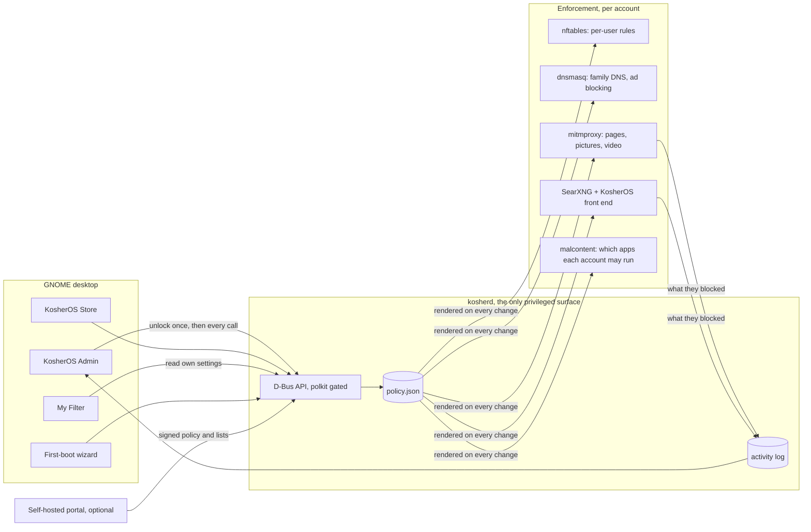

# Architecture

KosherOS is an immutable Fedora base, a GNOME desktop with three
per-account layouts, a content filter enforced per account at the network
layer, and administration without root. This page is the map; the pages
after it go into each part.

## Nobody has root

No `sudo` is shipped, the root account is locked, and a polkit rule removes
every polkit admin identity. That switches off every stock privileged
action: adding Flatpak remotes, rebasing the OS, changing the system
network. Stock update and package actions are denied quietly, with no
prompt, so desktop components do not pop a password dialog nothing could
satisfy.

The one privileged surface is **kosherd**, a root daemon with a D-Bus API.
Members of the `kosher-admin` group hold its `org.kosherlinux.*` polkit
actions from their own signed-in session, so an administrator is never
asked for a password to manage accounts, install apps, connect Wi-Fi or
apply updates. On any other account those actions ask for an
administrator's password once, through GNOME's own polkit agent, and the
daemon keeps a sliding session so nothing prompts again that sitting.

A short list of everyday settings is granted back to administrators without
a prompt, time zone, language, device name, joining a Wi-Fi network,
printers, colour profiles, so GNOME Settings works for a parent without
ever reaching services, packages or the image.

The daemon leans on the services that already exist, accountsservice,
Flatpak, bootc and NetworkManager, rather than reimplementing them.

**The guardian password.** Optionally, every call that weakens the filter
needs a second password on top, meant for the other spouse: changing an
account's mode, its sites, rules, categories, pictures, language, YouTube,
time limits or ports beyond the web; putting an account in a group or
changing the group; editing a list; approving a request; opening the store
or changing app blocks; the guest account; ad blocking; the update channel;
enrolling in or leaving a portal; making someone an administrator; and
turning the guardian off. It is stored as a yescrypt hash and rate limited, five tries
and then a fifteen-minute lockout.

## Two planes of enforcement

**DNS.** systemd-resolved is masked. dnsmasq is the only resolver, on
loopback, with its upstream fixed to a family-filtered service. nftables
redirects every human account's port-53 traffic to it, so picking another
resolver is impossible. Everyone gets family-filtered DNS and ad blocking
as a baseline; per-account differences happen at the packet layer. There
are two resolver instances, one for filtered accounts and a plain one for
unfiltered accounts, and the ad list is rendered into both.

**Packets.** One nftables table, rendered from the policy and loaded
fail-closed before the network comes up. Every packet is dispatched by the
owning uid:

| Mode | In the admin app | Enforcement |
|---|---|---|
| `none` | No internet | loopback and LAN printing only; everything else refused |
| `whitelist` | Approved sites only | only addresses in the whitelist sets, which dnsmasq fills as it resolves approved names, so browsing by bare address is blocked for free |
| `dnsfilter` | Basic protection | open on 80 and 443 and the named mail ports, behind family DNS and evasion blocking |
| `filtered` | Filtered internet | every TCP connection diverted into the account's own proxy listener |
| `unfiltered` | No filtering | open |

An account with no policy falls through to `none`. A shared chain refuses
DNS over TLS, QUIC and a set of DNS-over-HTTPS resolver addresses,
including the unfiltered public resolvers. Rootless containers do not
escape any of this: a user's network namespace reaches the host through an
ordinary process owned by that user, so the uid rules still match. A
captive-portal window, for hotel and airport Wi-Fi, is a set element with a
timeout.

## Filtered mode

At the DNS and packet layers a request is only ever "some host". The path
is encrypted, so `site.com/videos` cannot be told from `site.com/learn`.
Filtered mode terminates TLS locally so the full address and the page are
visible, and it is the only mode that can read a page, judge a picture, or
apply YouTube limits.

The daemon generates a certificate authority once, installs it in the
system trust store, and enables Firefox's enterprise-roots policy. The
cost, that this account's HTTPS is decrypted on this machine, is stated in
the admin app beside the mode. The proxy runs as its own unprivileged user,
one loopback listener per filtered account, and never reads the policy: the
daemon renders only what each account needs into a file the proxy can
read. [Content filtering](content-filtering.md) and [pictures and
video](media-filtering.md) describe what it does with what it sees.

## Apps

KosherOS hosts no package repository. Upstream Flathub is the source, and
only the daemon installs: polkit denies the Flatpak system-helper actions
to every non-root subject, and malcontent blocks user-scope installs. The
KosherOS Store is open to every account, supervised ones included, because
safety comes from the daemon's decision rather than from hiding the store.
The Store asks the daemon what this account may have, asks it to install,
and shows progress streamed back over D-Bus.

What an account may have is one rule, asked by the Store, by the installer
and by malcontent, so what cannot be installed cannot be run either:

1. **Blocks first.** Single apps and kinds of app a parent has blocked
   apply whatever else says. The kinds are the Store's own shelves,
   Internet, Work, Learning, Games, Music, Pictures & video, Developer
   tools, Utilities, folded from Flathub's categories.
2. **An approval settles it.** The approved list is what an administrator
   has said yes to by name.
3. **Approved only, or the whole store.** Every account starts with the
   approved list. A parent can open an account, or a group, to the whole
   store, and then:
4. **The content ceiling.** Flathub rates every app, and the daemon
   refuses anything above a fixed ceiling: nudity, sexual themes, bad
   language, gambling, drugs and graphic violence at none; cartoon and
   fantasy violence up to moderate; alcohol, tobacco and realistic
   violence up to mild. A short list of filter-circumvention tools, Tor
   launchers and VPN clients, is refused the same way. An app the index
   does not know is refused too, so being offline fails closed.

The app index is parsed once per catalogue download on a worker thread and
cached, so neither the Store nor a policy change waits on a forty-megabyte
parse. `kosherctl apps` shows and sets an account's access and blocks.

## The policy

One JSON document holds every account's settings and is the contract
between the daemon, the admin app and the portal. Its schema is in the
repository. A revision number and a source field are what make a second
writer safe.

## The portal

The portal is self-hostable and optional. It is a second writer of the
policy, so the device has to tell a genuine document from anything else,
and it does that with signatures rather than trust in the connection. The
portal generates an Ed25519 key on first start and signs every document; a
device pins the public half when it enrols with a one-time code, and
accepts a document only if the signature matches and the revision is
higher than the one it already applied, which is what stops an old,
looser policy being replayed at it. The device never signs and never holds
a private key, so a stolen device cannot forge policy for another one.

Sync is outbound only, every fifteen minutes, so no family machine opens
an inbound port. Enrolling and unenrolling take the guardian password.
Losing the portal does not unlock a device: the last applied policy keeps
being enforced.

## First boot

The installer creates no users and asks no passwords. On first boot a
kiosk session runs the setup wizard instead of the login screen, so the
machine cannot be used before it is configured. The wizard creates the
administrator, optionally sets the guardian password and a boot-menu
password, and shows the firmware checklist KosherOS cannot enforce itself:
a firmware password, USB and network boot off, Secure Boot kept on.
Finishing writes a stamp, disables the unit and starts the login screen.

The setup interface is the one path that runs without an authorised
administrator, because none exists yet, and it is bounded: creating the
first administrator is refused once any administrator is in the policy,
and every setup method is refused once the stamp exists. A wizard
interrupted after creating the administrator can still resume, because
completion is the stamp, not the existence of an administrator.

## Device security

Settings, Privacy & Security, Device Security reports the firmware's
security checks. Three of them are the operating system's to answer, and
the image sets all three on the kernel command line: lockdown in integrity
mode, so root cannot rewrite the running kernel even on a machine booted
without Secure Boot; the IOMMU on; and suspend-to-idle rather than deep
sleep, which leaves the memory image where firmware attacks can reach it.
Nothing in the image loads an out-of-tree kernel module, so lockdown costs
the family nothing.

The rest of that panel is the owner's or the vendor's. On ordinary consumer
hardware it will keep saying "checks failed" however well the OS behaves,
and one item stays red by design, because Fedora swaps to zram and the
check counts that as unencrypted swap. Nothing on that screen affects
whether KosherOS is filtering.

## Updates

The OS is a container image built on Fedora bootc. CI builds it, signs it
and publishes it. A parent applies an update from the Updates page in
KosherOS Admin; the machine restarts into it atomically and keeps the
previous version to go back to. Updates are not applied on their own.
[Updates and channels](deployment.md) has the detail.
