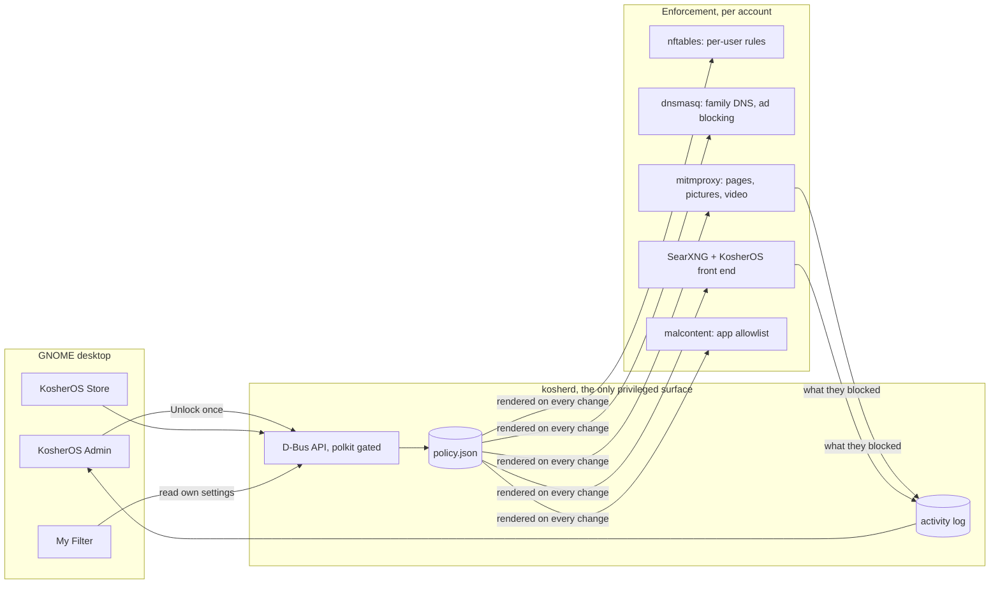

# KosherOS

**A family computer that is filtered, locked down, and still a real computer.**

A Linux distribution for frum families: a modern GNOME desktop on an immutable Fedora
base, with a content filter that lives on the machine itself and a parent in charge
without anyone having root. Powered by Fedora.

!!! warning "Pre-alpha"

    Everything here is built and covered by tests, but very little has been lived with
    on a real machine yet. See [what is and is not proven](#status).

[Releases](releases.md){ .md-button } [What works](supported.md){ .md-button }
[How it is built](architecture.md){ .md-button }


## The idea

Most kosher filters are a service you subscribe to and a browser you are told to use.
KosherOS is an operating system. The filter runs on the machine, works for every browser
and every app, cannot be uninstalled by the person it applies to, and is configured by a
parent in the family's own words: *Child*, *Teenager*, *hide immodest pictures*,
*replace bad language with a milder word*.

Three ideas hold it together.

**Complete out of the box.** A parent installs it, picks a preset for each account, and
is done. The category lists, word lists and picture filter ship whole; adding a site or a
word is possible, but never required.

**Local first.** Filtering happens on the device, on modest hardware, with no account and
no subscription. Nothing about what the family reads leaves the house.

**Locked, not hidden.** There is no root. The root filesystem is read-only and updates are
atomic and signed. The one privileged surface is a small daemon, and the only thing it
will do for a parent is what the app offers. An optional second *guardian* password (the
other spouse's) is required on top for any change that weakens the filter.

## What a family gets

One choice per account. Each account is set up as a preset, and the preset sets everything
under it; any of it can still be changed afterwards.

| Preset | Web | Pictures | Language | YouTube | Apps |
|---|---|---|---|---|---|
| **Young child** | only an approved list of sites | none from the web | replaced | none | chosen by the parent |
| **Child** | filtered: adult, gambling, dating, social, video and more blocked | immodest hidden | replaced | strict, entertainment and gaming blocked | chosen by the parent |
| **Teenager** | filtered: adult and gambling blocked, news and approved video allowed | immodest hidden | replaced | moderate | can install approved apps |
| **Adult** | filtered: adult content and filter bypasses blocked | immodest hidden | left alone | moderate | can install approved apps |
| **Basic protection** | known bad sites blocked at DNS, safe search forced, nothing decrypted | shown | left alone | moderate | can install approved apps |
| **No filtering** | open | shown | left alone | open | can install approved apps |

**Filtering that reads the page, not just the address.** In the filtered modes the machine
inspects the connection locally, so it can block a *page* rather than a whole site, clean
up language on a page that is otherwise fine, judge a page nobody has catalogued by its
words, cover the figure in a picture instead of blanking the site, look inside a video a
few frames at a time, and apply YouTube limits inside the app rather than on top of it.
Ads and trackers are blocked at the resolver for every account, the way a Pi-hole does it.
See [content filtering](content-filtering.md) and [media filtering](media-filtering.md).

**Search that respects the filter.** A local SearXNG behind a KosherOS front end filters
results with the same policy as the traffic, so a filtered user never clicks into a block
page and a whitelist user can finally *see* what the whitelist contains. See
[search](search.md).

**Apps from an allowlist.** The KosherOS Store installs from upstream Flathub, limited to
the apps a parent has approved, and keeps them current: an Updates shelf appears whenever an
installed app has a newer build, with one button per app and one for all of them. A guest
account can be switched on, given its own kind of internet, and is wiped at sign-out.

**A window for the person being filtered.** *My Filter* is a read-only app on every account
that says, in plain language, what applies to you. A child who can see the rules is likelier
to accept them than one who only ever meets a blocked page.

## What the parent sees

The admin app opens with one password and then everything works without another prompt.

<div class="grid cards" markdown>

- 

    **One person, one page.** The filter mode as a badge, the protection as chips, how far
    the account has drifted from its preset with a way back, what was blocked today with an
    Allow button beside it.

- 

    **The filter's own diary.** What it blocked, hid or refused, newest first, with the
    people as filters. A record of the filter, not of the person: what was allowed through
    is never written down.

</div>


**Everyone is one click away.** The sidebar lists the family by name, each with the
preset they are set up as and a badge when they are waiting on an answer, and below them
*Administration*: the activity feed and what is not about one person, in three pages —
Protection, Apps and Updates. Protection opens on whether the filter is
actually working, and then on the things one machine can only answer once — ad and tracker
blocking, the word lists, the guardian password.

Requests come first: when somebody asks for a blocked page from the block page, a blue
banner says so and one click answers it. Filter health is honest: if picture checking has
backed off or a service is down, an amber banner says exactly what is not being enforced.

## How it works



Nobody has root: no `sudo` is shipped, the root account is locked, and a polkit rule
removes every polkit admin identity. Members of the `kosher-admin` group are granted the
`org.kosherlinux.*` actions instead, and one unlock opens a sliding session so nothing
prompts again. Full detail in [architecture](architecture.md).

## Getting started

KosherOS is pre-alpha and nothing is hosted for download yet, so trying it means building
it. From a clone, inside the [devenv](https://devenv.sh) shell:

```sh
just build        # build the OS image
just vm           # make a bootable disk from it (needs sudo)
just try          # boot a throwaway copy; the first boot runs the setup wizard
```

To install on real hardware, `just release-iso` builds an installer ISO from the published
stable image, so the machine it installs follows the stable channel and updates itself.
`just usb-image` writes a system you can try from a USB stick without touching the internal
disk.

To look at the apps without installing anything, `just admin-demo` and `just store-demo`
open them against a pretend daemon with a sample family.

## Status

Built and covered by tests: over twelve hundred unit tests, widget tests that build the
real GTK screens, and live checks that exercise the firewall, the resolver and the proxy
inside the built image.

Not yet proven: time on a booted machine. Several recent pieces have been seen rendering
but not used on a real KosherOS session, and the update-rollback path has never fired for
real. Treat every claim here as "built and tested", not "proven in a home".

Where the project is going next is on the [deployment](deployment.md) page, and every build
so far is on the [releases](releases.md) page.
