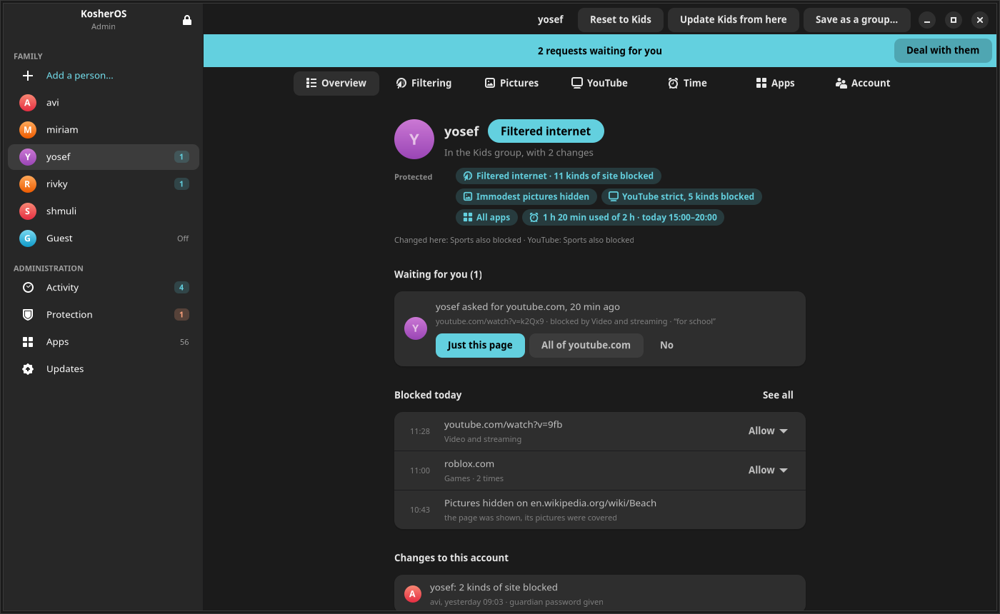
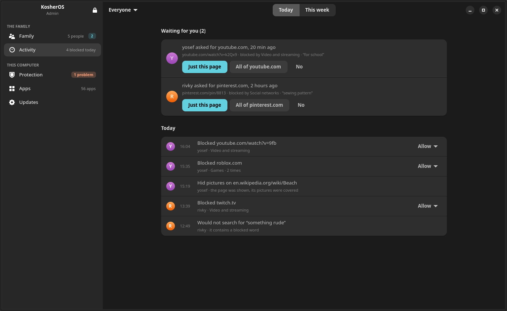
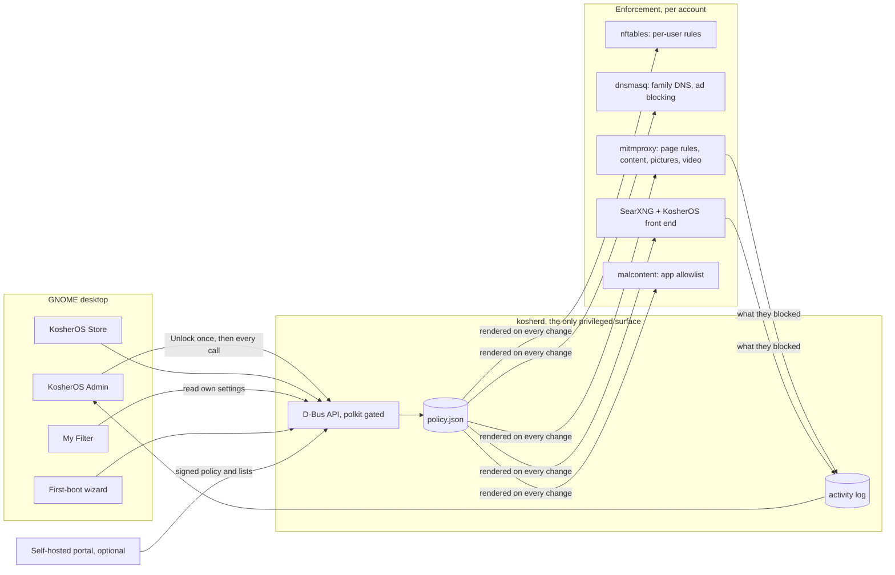

<a id="readme-top"></a>

<div align="center">

[![CI][ci-shield]][ci-url]
[![Stars][stars-shield]][stars-url]
[![Issues][issues-shield]][issues-url]
[![Licence][licence-shield]][licence-url]
[![Status: pre-alpha][status-shield]](#status)

<br />


# KosherOS

**A family computer that is filtered, locked down, and still a real computer.**

A Linux distribution for frum families: a modern GNOME desktop on an immutable Fedora base,
with a content filter that lives on the machine itself and a parent in charge without anyone having root.

*Powered by Fedora.*

[Read the docs](https://aareman.github.io/KosherOS/) · [What works](https://aareman.github.io/KosherOS/supported/) · [Releases](https://aareman.github.io/KosherOS/releases/) · [Report a bug][issues-url]

</div>

<details>
<summary><strong>Table of contents</strong></summary>

1. [About](#about)
   - [Who it is for](#who-it-is-for)
   - [What a family gets](#what-a-family-gets)
   - [What the parent sees](#what-the-parent-sees)
2. [How it works](#how-it-works)
   - [Nobody has root](#nobody-has-root)
   - [Filtering, from the wire to the picture](#filtering-from-the-wire-to-the-picture)
   - [Built with](#built-with)
3. [Getting started](#getting-started)
   - [Try KosherOS](#try-kosheros)
   - [Develop on it](#develop-on-it)
   - [Everyday commands](#everyday-commands)
4. [Repository layout](#repository-layout)
5. [Status](#status)
6. [Roadmap](#roadmap)
7. [Contributing](#contributing)
8. [Licence](#licence)
9. [Acknowledgments](#acknowledgments)

</details>

## About

<div align="center">

<br><sub>The admin app's home screen. One card per person, what each is protected from, what happened today.</sub>
</div>

<br>

Most kosher filters are a service you subscribe to and a browser you are told to use. KosherOS is an
operating system. The filter runs on the machine, works for every browser and every app, cannot be
uninstalled by the person it applies to, and is configured by a parent in the family's own words:
*hide immodest pictures*, *replace bad language with a milder word*.

Three ideas hold it together:

- **Complete out of the box.** A parent installs it, puts each person in a group of their own
  naming — or leaves the strict default — and is done. The category lists, word lists and picture
  filter ship whole; adding a site or a word is possible, but never required.
- **Local first.** Filtering happens on the device, on modest hardware, with no account and no
  subscription. Nothing about what the family reads leaves the house.
- **Locked, not hidden.** There is no root. The root filesystem is read-only and updates are
  atomic and signed. The one privileged surface is a small daemon, and the only thing it will do
  for a parent is what the app offers. An optional second *guardian* password (the other spouse's)
  is required on top for any change that weakens the filter.

### Who it is for

Ordinary families who do not have the time or the background to build a filter, and who need it to
be right on day one. Also anyone who wants a computer for a spouse, an employee or a guest that
stays the way it was set up. The words *user account* and *admin account* are used throughout;
nothing here assumes the filtered person is a child.

### What a family gets

**Groups the family names.** Nothing ready-made ships: *Child* means something different in
every home. A parent tunes one account, saves it as a group, and puts the others in it; change the
group and every account in it changes. An account in no group gets the strict default. The groups
below are examples of what a family might make (they are the sample family's), not something the
system decides for them.

| Group | Web | Pictures | Language | YouTube | Apps |
|---|---|---|---|---|---|
| **Default** (no group) | filtered: adult, gambling, dating, social, video and more blocked | immodest hidden | replaced | strict; entertainment, gaming, music and Shorts blocked | chosen by the parent |
| **Little ones** | only an approved list of sites | none from the web | replaced | none | chosen by the parent |
| **Kids** | filtered: adult, gambling, dating, social, video and more blocked | immodest hidden | replaced | strict; entertainment, gaming, music and Shorts blocked | chosen by the parent |
| **Teens** | filtered: adult and gambling blocked, news and approved video allowed | immodest hidden | replaced | moderate | can install approved apps |
| **Grown-ups** | filtered: adult content and filter bypasses blocked | immodest hidden | left alone | moderate | can install approved apps |

**Filtering that reads the page, not just the address.** In the filtered modes the machine
inspects the connection locally, so it can block a *page* rather than a whole site, clean up
language on a page that is otherwise fine, judge a page nobody has catalogued by its words,
cover the figure in a picture instead of blanking the site, look inside a video a few frames at a
time, and apply YouTube limits inside the app rather than on top of it. Ads and trackers are
blocked at the resolver for every account, the way a Pi-hole does it.
See [docs/content-filtering.md](docs/content-filtering.md) and
[docs/media-filtering.md](docs/media-filtering.md).

**Search that respects the filter.** A local SearXNG behind a KosherOS front end filters results
with the same policy as the traffic, so a filtered user never clicks into a block page and a
whitelist user can finally *see* what the whitelist contains. Searches inside large sites, and their
suggestions, are filtered too. See [docs/search.md](docs/search.md).

**Apps from an allowlist.** The KosherOS Store installs from upstream Flathub, limited to the
apps a parent has approved. A guest account can be switched on, given its own kind of internet,
and is wiped at sign-out.

**A window for the person being filtered.** *My Filter* is a read-only app on every account that
says, in plain language, what applies to you. A child who can see the rules is likelier to accept
them than one who only ever meets a blocked page.

### What the parent sees

The admin app opens with one password and then everything works without another prompt.

<div align="center">


<br><sub>Left: one person's page. Right: the activity tab, the filter's own diary.</sub>
</div>

<br>

- **Requests, first.** When someone asks for a blocked page from the block page, a blue banner
  says so and one click answers it: just this page, the whole site, or no. The filter's reason
  travels with the request.
- **Health, honestly.** If picture checking has backed off or a service is down, Protection
  wears an amber count in the sidebar and its page says exactly what is not being enforced.
  When all is well the page says so, with the time it was checked.
- **Drift, named.** An account one switch away from *Child* reads as "Child, with 1 change:
  Sports also blocked", with a Reset button, not as "Custom".
- **Blocks become allows.** Everything the filter did is written to an activity log, a record of
  the filter rather than of the person: what was allowed through is never recorded. A blocked
  page can be allowed from the log before anyone has to ask, and settings changes appear with the
  admin who made them.

<p align="right">(<a href="#readme-top">back to top</a>)</p>

## How it works



### Nobody has root

No `sudo` is shipped, the root account is locked, and a polkit rule removes every polkit admin
identity, which switches off the stock privileged actions: adding Flatpak remotes, rebasing the
OS, changing the system network. Members of the `kosher-admin` group are granted the
`org.kosherlinux.*` actions instead, and one `Unlock` opens a sliding session so nothing prompts
again. kosherd leans on the services that already exist (accountsservice, Flatpak, bootc,
NetworkManager) rather than reimplementing them. Filter-weakening calls can additionally require
the guardian password. Full detail in [docs/architecture.md](docs/architecture.md).

### Filtering, from the wire to the picture

| Layer | Mechanism | What it decides |
|---|---|---|
| Packets | `table inet kosher`, rendered from the policy | which accounts reach the internet at all, and whose web traffic is diverted into the proxy |
| DNS | dnsmasq as the only resolver, upstream Cloudflare Family, ad and tracker lists | known bad sites, safe search, ads, and the whitelist for whitelist-only accounts |
| Pages | mitmproxy with a locally generated CA, one listener per filtered account | page rules, category lists, page-content scoring, shop department rules, language clean-up, YouTube limits |
| Pictures and video | an on-device detector with region covering, sampled keyframes for video | what is hidden, what is covered, and how |
| Search | SearXNG on loopback behind a KosherOS front end | which results a person sees, and which searches will not run |
| Apps | malcontent plus a kosherd allowlist over Flathub | which apps each account may run and install |

Every list ships complete, and the machine says so when a list failed to load or picture checking
has backed off: a filter that has quietly stopped is worse than one that never started.

### Built with

[![Fedora bootc][fedora-shield]][fedora-url]
[![GNOME][gnome-shield]][gnome-url]
[![Python][python-shield]][python-url]
[![GTK4 / libadwaita][gtk-shield]][gtk-url]
[![mitmproxy][mitm-shield]][mitm-url]
[![nftables][nft-shield]][nft-url]
[![dnsmasq][dnsmasq-shield]][dnsmasq-url]
[![SearXNG][searx-shield]][searx-url]

<p align="right">(<a href="#readme-top">back to top</a>)</p>

## Getting started

### Try KosherOS

KosherOS is pre-alpha and nothing is hosted yet, so trying it means building it. Every command
below runs from the repository root inside the dev shell.

```sh
just build        # build the OS image (layer-cached; a few minutes the first time)
just vm           # make a bootable disk from it (needs sudo)
just try          # boot a throwaway copy of that disk; the first boot runs the setup wizard
```

To try it on real hardware without touching the internal disk:

```sh
just usb-image    # a raw disk image to write to a USB stick with dd
```

The first boot asks for the administrator's name and password, an optional guardian password, and
a boot password, then lands on the desktop. From there, open **KosherOS Admin**, add a person,
and either leave the strict default or save their tuned settings as a group for the others.

### Develop on it

All tooling comes from [devenv](https://devenv.sh); nothing is installed on the host.

```sh
git clone git@github.com:aareman/KosherOS.git
cd KosherOS
devenv shell      # or let direnv do it on cd
just test         # the unit suites: about fifteen seconds, no root, no VM
```

Every merge carries its own version, plain `0.x.x` semver. CI writes the
next number once for every push to master — committing it to master and
building that commit — so each released image and ISO can be told apart and
a bug report can say which build it came from. The number reaches
os-release, the installer's welcome screen, the ISO's file name and the
admin app's Updates page.

How far it steps comes from the merge's own commit subjects: a `feat` moves
the minor, anything else moves the patch, and a breaking change moves the
minor too, which is what a zero major version is for. The major never moves
on its own — 1.0.0 is a decision, made by editing `VERSION`. After a merge,
`git pull` before your next push: master has CI's version commit on it.

The daemons are ordinary Python projects. Most work needs no image at all:

```sh
just fedora-vm       # fetch and boot a stock Fedora test VM (plain QEMU/KVM)
just dev-install     # install the whole filter stack into it
just deploy-kosherd  # push local kosherd code into the VM and restart it, about a second
just fedora-ssh      # a shell in the VM
```

Image changes go through `just build`, and a running VM picks them up with `just vm-upgrade`, which
pulls only the changed layers and stages an atomic reboot.

### Everyday commands

| Command | What it does |
|---|---|
| `just test` | unit suites for kosherd, the search service, the admin app, the setup wizard and the portal |
| `just test-cov` | the same with a coverage report |
| `just test-vm` | integration suites inside the dev VM: services, enforcement, apps, guest, inspect mode, persistence |
| `just check-all` | live checks against the built image: the firewall stops who it should, the resolver answers as claimed, traffic is diverted into the proxy, the services run |
| `just render` | render and syntax-check the example policy as nftables rules |
| `just benchmark CPUS=2` | measure what the filter costs on a weak machine, inside the built image |
| `just iso` | an installable ISO that asks which disk to use |
| `just boot-iso`, `just boot-installed` | rehearse a real install into a blank disk, then boot it |
| `just test-boot` | boot the disk image and assert it reaches the setup wizard |
| `just portal-run` | run the self-hosted portal locally |

`just vm`, `just iso` and the steps that run podman as root need sudo, so run those in a normal
terminal. They ask for the password first thing and keep it fresh until they finish, so the
prompt never appears in the middle of a long build. Once a VM is up, a root shell is on port 2223 while `just boot-image` runs.

<p align="right">(<a href="#readme-top">back to top</a>)</p>

## Repository layout

| Path | What lives there |
|---|---|
| `kosherd/` | the privileged daemon, the policy engine, the activity log and the `kosherctl` CLI (Python) |
| `admin-app/` | KosherOS Admin: the family board, the activity feed, a page per person (GTK4, libadwaita) |
| `store-app/` | KosherOS Store: install approved apps (GTK4, open to every account) |
| `myfilter-app/` | My Filter: a read-only view of your own account's rules (GTK4, open to every account) |
| `setup-app/` | KosherOS Setup: the first-boot wizard (GTK4) |
| `search-app/` | the filtered search front end in front of SearXNG |
| `mitm/` | the mitmproxy addon that does the page, picture and video filtering |
| `portal/` | the self-hostable portal: signed policy sync for enrolled devices (FastAPI) |
| `policy/` | the policy JSON schema and examples, the contract between device, admin app and portal |
| `os-image/` | the distribution itself: the Containerfile and every file the image carries |
| `branding/` | logo and wallpaper source art, and the script that makes every raster from them |
| `scripts/` | list fetching, live checks, the stage-1 VM installer |
| `docs/` | [architecture](docs/architecture.md), [content filtering](docs/content-filtering.md), [media filtering](docs/media-filtering.md), [search](docs/search.md), [desktop](docs/desktop.md), [branding](docs/branding.md), [deployment](docs/deployment.md), [licensing](docs/licensing.md), [testing](docs/testing.md), [standalone](docs/standalone.md) |
| `legacy/` | the retired e2guardian/Ubuntu prototype, kept for reference |

## Status

**Pre-alpha. Use at your own risk.** The pieces below are built and covered by tests: over a
thousand unit tests, widget tests that build the real GTK screens on a virtual display, and live
checks that exercise the firewall, the resolver and the proxy inside the built image. What has
*not* happened is enough time on a booted machine. Several recent pieces, including the admin
redesign, the desktop layouts and My Filter, have been seen rendering but not yet used on a real
KosherOS session, and the update-rollback path has never fired for real. Treat every claim above
as "built and tested", not "proven in a home".

## Roadmap

- [x] **Filter core**: kosherd, per-account nftables enforcement, dnsmasq whitelist sets, `kosherctl`
- [x] **Immutable OS image** on Fedora bootc: builds, lint-clean, boots to GNOME
- [x] **Admin app and Store**: an approved-app allowlist over upstream Flathub, installs performed by kosherd with live progress
- [x] **Branding**: identity, boot splash, login screen, wallpaper ([docs/branding.md](docs/branding.md)); real logo artwork still to come
- [x] **Desktop layouts** per account: classic, tiling (PaperWM) and advanced (niri with Noctalia) ([docs/desktop.md](docs/desktop.md))
- [x] **Installable ISO** and a first-boot wizard: admin account, guardian, boot password, firmware checklist
- [x] **Portal**: signed policy sync, signed list updates and a signed catalogue manifest; remote support and a web UI still to come
- [x] **Filtered mode**: local TLS interception with path-level allow and block rules
- [x] **Real content filtering**: category lists, groups, page-content scoring, shop department rules, picture detection with region covering, video keyframes, YouTube limits, Pi-hole style ad blocking, request-and-approve from the block page
- [x] **Filtered search** ([docs/search.md](docs/search.md))
- [x] **My Filter**: a read-only settings viewer on every account
- [x] **Admin app redesign**: the family board, the activity log, requests as a banner, drift named and reversible, a full page per person
- [x] **Rollback**: `kosherctl system rollback`, "Go back to the previous version" in the admin app, greenboot returning to the last good image on its own
- [ ] **A tzniut classifier**, so the *immodest* picture level is as strong as the two above it
- [ ] **A live "try it" ISO** that boots to the desktop and offers Install
- [x] **Anaconda installer branding**: `just iso` puts a KosherOS `product.img` on the ISO, so the installer says KosherOS and wears the mark; not yet seen on a booted installer
- [ ] **Deployment**: signature verification on the machine, a release ISO pinned at a public registry, update channels ([docs/deployment.md](docs/deployment.md))
- [ ] **A long session on a booted machine** with the whole family flow, under GNOME
- [ ] **Licence and contribution files**: `LICENSE` and `CONTRIBUTING.md` ([docs/licensing.md](docs/licensing.md))

Not on the roadmap but assessed: the filter is separable from the OS. See
[docs/standalone.md](docs/standalone.md) for what a distro-agnostic package would take, and for a
straight answer about what can and cannot be locked down when the user has `sudo`.

See the [open issues][issues-url] for the full list of proposed features and known problems.

<p align="right">(<a href="#readme-top">back to top</a>)</p>

## Contributing

Contributions are welcome, and the bar is the one the product sets for itself: a family should
never need to understand any of this to be protected by it.

1. Fork the project and create a branch (`git checkout -b feature/short-name`)
2. Run `just test` before and after; add a test for what you changed. UI work gets a widget test that builds the real screen.
3. Commit in small, focused steps with a message that says what changed and why
4. Push the branch and open a pull request

Things that are always welcome without asking first: a site or word the shipped lists miss, a
sentence in the apps that a parent would not understand, a claim in these docs that a booted
machine proved wrong. A `CONTRIBUTING.md` with the DCO is on the roadmap; until then, sign your
commits off (`git commit -s`) to say you have the right to contribute them.

## Licence

KosherOS is intended to be released under the **GNU Affero General Public License v3.0 or
later**. The `LICENSE` file is not committed yet; the reasoning, the trademark plan for the
KosherOS name, and the licence of every shipped list are set out in
[docs/licensing.md](docs/licensing.md) and [THIRD-PARTY.md](THIRD-PARTY.md). *Fedora* is a
trademark of Red Hat; KosherOS is a Fedora Remix and is not endorsed by the Fedora Project.

## Acknowledgments

- [Fedora](https://fedoraproject.org) and [bootc](https://bootc-dev.github.io/bootc/), the immutable base that makes atomic, signed updates and a read-only root ordinary
- [GNOME](https://www.gnome.org), [GTK](https://gtk.org) and [libadwaita](https://gnome.pages.gitlab.gnome.org/libadwaita/), the desktop and the toolkit every app here is built with
- [mitmproxy](https://mitmproxy.org), [nftables](https://netfilter.org/projects/nftables/) and [dnsmasq](https://thekelleys.org.uk/dnsmasq/doc.html), which do the enforcing
- [SearXNG](https://github.com/searxng/searxng), behind the filtered search
- [UT1 (Université Toulouse 1 Capitole)](https://dsi.ut-capitole.fr/blacklists/) and the other list maintainers named in [THIRD-PARTY.md](THIRD-PARTY.md), whose work is what makes "complete out of the box" possible
- [PaperWM](https://github.com/paperwm/PaperWM), [niri](https://github.com/YaLTeR/niri) and Noctalia, for the tiling and advanced desktops
- [Pi-hole](https://pi-hole.net), whose approach to ad blocking this follows
- [Best-README-Template](https://github.com/othneildrew/Best-README-Template), which this page grew out of

<p align="right">(<a href="#readme-top">back to top</a>)</p>

<!-- MARKDOWN LINKS & IMAGES -->
[ci-shield]: https://img.shields.io/github/actions/workflow/status/aareman/KosherOS/ci.yml?branch=master&style=for-the-badge&label=CI
[ci-url]: https://github.com/aareman/KosherOS/actions/workflows/ci.yml
[stars-shield]: https://img.shields.io/github/stars/aareman/KosherOS.svg?style=for-the-badge
[stars-url]: https://github.com/aareman/KosherOS/stargazers
[issues-shield]: https://img.shields.io/github/issues/aareman/KosherOS.svg?style=for-the-badge
[issues-url]: https://github.com/aareman/KosherOS/issues
[licence-shield]: https://img.shields.io/badge/licence-AGPL--3.0--or--later_(pending)-blue?style=for-the-badge
[licence-url]: docs/licensing.md
[status-shield]: https://img.shields.io/badge/status-pre--alpha-orange?style=for-the-badge
[fedora-shield]: https://img.shields.io/badge/Fedora_bootc-51A2DA?style=for-the-badge&logo=fedora&logoColor=white
[fedora-url]: https://bootc-dev.github.io/bootc/
[gnome-shield]: https://img.shields.io/badge/GNOME-4A86CF?style=for-the-badge&logo=gnome&logoColor=white
[gnome-url]: https://www.gnome.org
[python-shield]: https://img.shields.io/badge/Python-3776AB?style=for-the-badge&logo=python&logoColor=white
[python-url]: https://www.python.org
[gtk-shield]: https://img.shields.io/badge/GTK4_%2F_libadwaita-7FE719?style=for-the-badge&logo=gtk&logoColor=black
[gtk-url]: https://gnome.pages.gitlab.gnome.org/libadwaita/
[mitm-shield]: https://img.shields.io/badge/mitmproxy-FFC800?style=for-the-badge&logoColor=black
[mitm-url]: https://mitmproxy.org
[nft-shield]: https://img.shields.io/badge/nftables-E95420?style=for-the-badge&logoColor=white
[nft-url]: https://netfilter.org/projects/nftables/
[dnsmasq-shield]: https://img.shields.io/badge/dnsmasq-333333?style=for-the-badge&logoColor=white
[dnsmasq-url]: https://thekelleys.org.uk/dnsmasq/doc.html
[searx-shield]: https://img.shields.io/badge/SearXNG-3050FF?style=for-the-badge&logoColor=white
[searx-url]: https://github.com/searxng/searxng
