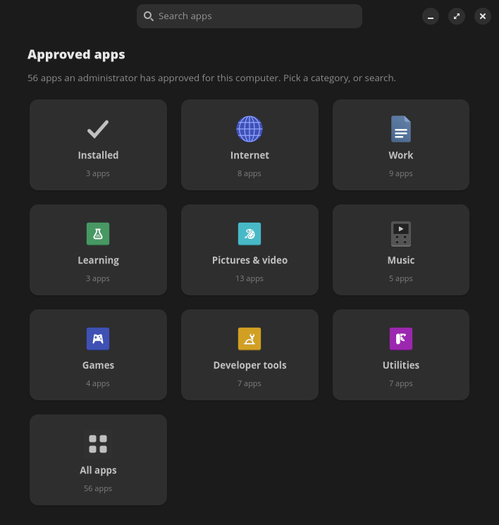
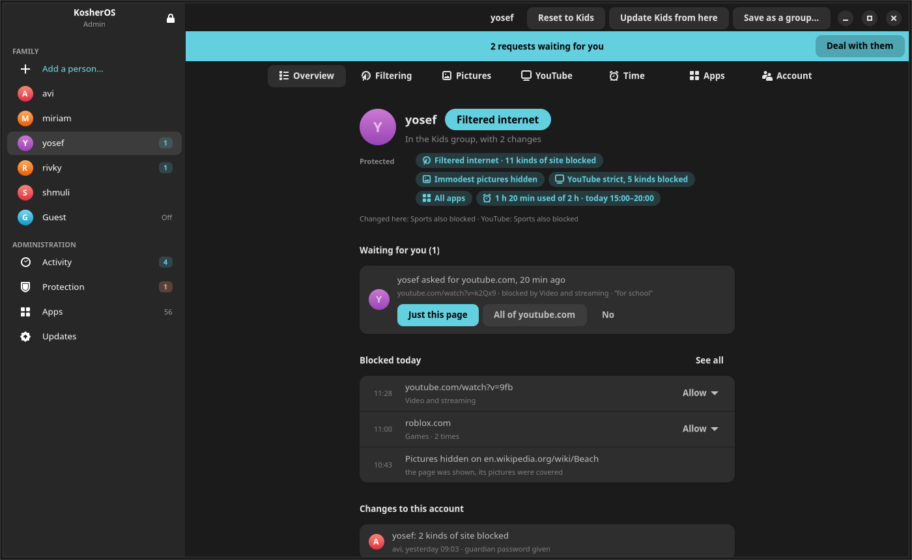
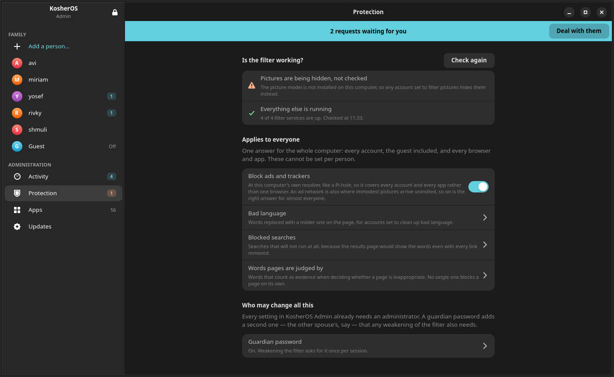

<div align="center">


# KosherOS

**A family computer that is filtered, locked down, and still a real computer.**

A Linux distribution for frum families. A modern GNOME desktop on an immutable Fedora base,
with the filter on the machine itself, no account or subscription, and a parent in charge.

*Powered by Fedora.*

**[Read the docs](https://aareman.github.io/KosherOS/overview/)** · [Website](https://aareman.github.io/KosherOS/) · [Releases](https://aareman.github.io/KosherOS/releases/) · [What works](https://aareman.github.io/KosherOS/supported/)

[![CI][ci-shield]][ci-url]
[![Status: pre-alpha][status-shield]](#status)

</div>


> **Pre-alpha.** Built and covered by tests, but not yet proven in a family's daily use.
> See [status](#status) and [what works](https://aareman.github.io/KosherOS/supported/)
> before trying it.

## The idea

KosherOS builds the operating system around what a Jewish family needs: a place for
homework, Torah learning, keeping in touch and getting things done. Filtering applies across browsers and apps, with settings
in the family's own words: *hide immodest pictures*, *replace bad language with a milder word*.

- **Complete out of the box.** Category lists, word lists and the picture filter ship with
  the system. A parent puts each person in a group of their own naming, or leaves the
  strict default. Adding a site or a word is possible; it is never homework.
- **Local first.** Filtering decisions happen on the device, with no filtering account to
  create and no subscription to renew.
- **Locked, not hidden.** Nobody has root, including the parent. The system is read-only,
  and kosherd is the small privileged daemon behind the apps. An optional second
  *guardian* password protects changes that weaken the filter.

## What a family gets

**Groups the family names.** Tune one account, save it as a group, and put the others in.
Change the group and every account in it changes. No ready-made family groups ship:
*Child* means something different in every home. An account in no group gets the strict
default. Each person can have filtered internet, approved sites only, basic protection,
no internet or no filtering. [See the defaults and supported software](docs/supported.md).

**Filtering that reads the page.** In filtered modes, local HTTPS inspection lets the
filter block a page without blocking its whole site, judge uncatalogued pages by their
words, replace bad language, cover figures in pictures, sample video and animation frames,
and enforce YouTube limits. Ads and trackers are blocked at the resolver.
[Content filtering](docs/content-filtering.md) · [Media filtering](docs/media-filtering.md)

**Time limits: how long, and when.** A parent can set a daily allowance and a weekly
schedule per account. Idle time does not count; restarting does not reset the allowance.
Warnings arrive before time runs out, and My Filter shows what is left. Administrators
are never limited. [Time limits](docs/time-limits.md)

**A store, search and a window onto the rules.** The Store offers approved apps from
Flathub, or the whole store with kinds of app and individual apps blocked under a content
rating ceiling. The Store also checks for and installs app updates. Local SearXNG search uses the
same policy as web traffic, and **My Filter** lets each person read their own settings.
A guest account can have its own kind of internet and is wiped at sign-out.
[Search](docs/search.md) · [Developer tools](docs/supported.md#developer-tools)



## What the parent sees

The admin app opens on the family, with a page per person. Requests for blocked pages
appear in a blue banner, with an answer one click away. Signed in as an administrator,
the admin app and system settings do not ask for a password; on another account, the
admin app asks for an administrator's password once for the sitting.



Everyone chooses their own password at first sign-in. A parent can reset a forgotten
password so the person chooses a new one at their next login; an administrator's own
password can only be changed by that administrator.

**Protection says whether the filter is working.** If picture checking has backed off or
a service is down, an amber count points to what is not being enforced. The activity log
records what the filter blocked, hid or refused; allowed browsing is never recorded.



**Updates has a way forward and a way back.** It shows the running version, available
updates, rollback and the Stable or Edge channel the machine follows. Switching channels
stages the other version for the next restart. See [deployment and updates](docs/deployment.md)
for the release path and remaining work before deployment to families.

## How it works

GTK4/libadwaita apps call **kosherd** through a polkit-gated D-Bus API. The daemon turns
policy into per-account nftables rules, dnsmasq configuration, mitmproxy filtering and app
permissions. A local SearXNG front end filters search results under the same policy.
An optional self-hosted portal supplies signed policy and list updates.

The system ships no `sudo`, locks the root account and limits privileged actions to those
the apps expose. The desktop offers classic GNOME, PaperWM tiling and niri with Noctalia.

[Architecture](docs/architecture.md) · [Desktop](docs/desktop.md) · [Branding](docs/branding.md)

## Getting started

To try KosherOS on a spare Intel or AMD computer, start with the
[USB installation guide](https://aareman.github.io/KosherOS/install/). It covers hardware
requirements and preparing a USB stick from Windows or macOS. You will need a
project-supplied installer; check [Releases](https://aareman.github.io/KosherOS/releases/)
for availability.

For developer testing, build a VM or open the app demos:

From a clone, enter the [devenv](https://devenv.sh) shell:

```sh
git clone https://github.com/aareman/KosherOS.git
cd KosherOS
devenv shell
```

Build and boot a throwaway VM:

```sh
just build        # build the OS image
just vm           # make a bootable disk from it (needs sudo)
just try          # boot a throwaway copy; first boot runs the setup wizard
```

The wizard sets up the administrator, optional guardian password and boot password.
Then open **KosherOS Admin**, add each person and leave the strict default or tune their
settings and save a group for others.

To look at the apps without installing the OS, run `just admin-demo` or `just store-demo`.
To try a system from a USB stick without installing to the internal disk, `just usb-image`
builds a raw disk image to write to the stick.

`just release-iso` builds an installer from the published stable image, so the installed
machine follows that channel; `just release-iso edge` selects Edge. Read the
[deployment guide](docs/deployment.md) for prerequisites and outstanding limitations.
Release notes are on the [Releases page](https://aareman.github.io/KosherOS/releases/).

## Development

The [contributor guide](https://aareman.github.io/KosherOS/contributing/) covers setup,
development loops, commit conventions and CI.

All tooling comes from [devenv](https://devenv.sh). From the development shell above,
run the unit suites without root or a VM:

```sh
just test
```

Entering the shell also installs git hooks (on commit, and on push for the
large-file check): merge-conflict markers,
stray large files, Python syntax, YAML and shellcheck, all of which rewrite
nothing and take milliseconds. `just check` runs them over every file rather
than the staged ones, and `just hooks` installs the hook into a checkout
whose shell has not been entered.

If you work in `git worktree`s, note that git keeps **one** hooks directory
for a repository and all of its worktrees. The installed hooks are therefore
one dispatcher that names no checkout: it asks git which tree is being
committed to or pushed from and runs that tree's own configuration
(`scripts/git-hook-dispatch.sh`). Do not replace it with one that hard-codes
a path — a hook naming a worktree breaks every commit and push in the
repository the moment that worktree is deleted.

Every merge carries its own version, plain `0.x.x` semver, and the git tag
is the version: nothing in the tree records it. `scripts/version.py` counts
any commit's number from the last tag reachable from it, and CI's release
job pushes that tag once the build has passed, last of all, so a run that
fails spends no number. Each released image and ISO can be told apart and a
bug report can say which build it came from. The number reaches os-release,
the installer's welcome screen, the ISO's file name and the admin app's
Updates page; a build made anywhere but CI calls itself
`0.7.0-dev.3+g2049571`, so it is never mistaken for a release.

How far it steps comes from the commit subjects since the last tag: a
`feat` moves the minor, anything else moves the patch, and a breaking change
moves the minor too, which is what a zero major version is for. The major
never moves on its own — 1.0.0 is a decision, made by pushing the tag
`v1.0.0` by hand. `python3 scripts/version.py show` says what your checkout
would be called.

The daemons are ordinary Python projects. Most work needs no image at all:

```sh
just fedora-vm       # fetch and boot a stock Fedora test VM (plain QEMU/KVM)
just dev-install     # install the whole filter stack into it
just deploy-kosherd  # push local kosherd code into the VM and restart it, about a second
just fedora-ssh      # a shell in the VM
```

Image changes go through `just build`, and a running VM picks them up with `just vm-upgrade`, which
pulls only the changed layers and stages an atomic reboot.

### Everyday commands

| Command | What it does |
|---|---|
| `just test` | unit suites for kosherd, the search service, the admin app, the setup wizard and the portal |
| `just test-cov` | the same with a coverage report |
| `just docs`, `just docs-serve` | build the documentation site, or preview it with live reload |
| `just test-vm` | integration suites inside the dev VM: services, enforcement, apps, guest, inspect mode, persistence |
| `just check-all` | live checks against the built image: the firewall stops who it should, the resolver answers as claimed, traffic is diverted into the proxy, the services run |
| `just render` | render and syntax-check the example policy as nftables rules |
| `just benchmark CPUS=2` | measure what the filter costs on a weak machine, inside the built image |
| `just iso` | an installable ISO that asks which disk to use |
| `just boot-iso`, `just boot-installed` | rehearse a real install into a blank disk, then boot it |
| `just test-boot` | boot the disk image and assert it reaches the setup wizard |
| `just portal-run` | run the self-hosted portal locally |

`just vm`, `just iso` and the steps that run podman as root need sudo, so run those in a normal
terminal. They ask for the password first thing and keep it fresh until they finish, so the
prompt never appears in the middle of a long build. Once a VM is up, a root shell is on port 2223 while `just boot-image` runs.

## Repository layout

| Path | What lives there |
|---|---|
| `kosherd/` | the privileged daemon, the policy engine, the activity log and the `kosherctl` CLI (Python) |
| `admin-app/` | KosherOS Admin: the family board, the activity feed, a page per person (GTK4, libadwaita) |
| `store-app/` | KosherOS Store: install approved apps (GTK4, open to every account) |
| `myfilter-app/` | My Filter: a read-only view of your own account's rules (GTK4, open to every account) |
| `setup-app/` | KosherOS Setup: the first-boot wizard (GTK4) |
| `search-app/` | the filtered search front end in front of SearXNG |
| `mitm/` | the mitmproxy addon that does the page, picture and video filtering |
| `portal/` | the self-hostable portal: signed policy sync for enrolled devices (FastAPI) |
| `policy/` | the policy JSON schema and examples, the contract between device, admin app and portal |
| `os-image/` | the distribution itself: the Containerfile and every file the image carries |
| `branding/` | logo and wallpaper source art, and the script that makes every raster from them |
| `scripts/` | list fetching, live checks, the stage-1 VM installer |
| `docs/` | [architecture](docs/architecture.md), [content filtering](docs/content-filtering.md), [media filtering](docs/media-filtering.md), [time limits](docs/time-limits.md), [search](docs/search.md), [desktop](docs/desktop.md), [branding](docs/branding.md), [deployment](docs/deployment.md), [licensing](docs/licensing.md), [testing](docs/testing.md), [standalone](docs/standalone.md) |
| `legacy/` | the retired e2guardian/Ubuntu prototype, kept for reference |

## Status

**Pre-alpha.** Unit tests, GTK widget tests and live checks cover the daemon, apps,
firewall, resolver and proxy. They do not establish that the system is ready for a family's
daily use: long sessions on a booted machine and the real update-rollback path still need
validation. [Testing](docs/testing.md) explains what each layer proves and what it does not.

The remaining work includes a stronger tzniut classifier, a live desktop ISO, deployment
hardening and the licence file. Channels and a release installer build already
exist. See [deployment](docs/deployment.md), [licensing](docs/licensing.md) and the
[open issues][issues-url] for details and current work.

The filter could also be separated from the OS; [the standalone assessment](docs/standalone.md)
explains what that would take and what can be enforced when the user has `sudo`.

## Contributing

Contributions are welcome, and the bar is the one the product sets for itself: a family should
never need to understand any of this to be protected by it.

1. Start from an issue, or open one.
2. Branch from `master`, run `just test` before and after, and add a test for what you changed.
3. Commit in small, focused steps, with a subject that says what changed for the person running KosherOS.
4. Open a pull request that links the issue.

Things that are always welcome without asking first: a site or word the shipped lists miss, a
sentence in the apps that a parent would not understand, a claim in these docs that a booted
machine proved wrong. [How to contribute](https://aareman.github.io/KosherOS/contributing/)
has the setup, the loops, the commit conventions and what CI does;
[CONTRIBUTING.md](CONTRIBUTING.md) is the short version.

## Licence

KosherOS is intended to be released under the **GNU Affero General Public License v3.0 or
later**. The `LICENSE` file is not committed yet; the reasoning, the trademark plan for the
KosherOS name, and the licence of every shipped list are set out in
[docs/licensing.md](docs/licensing.md) and [THIRD-PARTY.md](THIRD-PARTY.md). *Fedora* is a
trademark of Red Hat; KosherOS is a Fedora Remix and is not endorsed by the Fedora Project.

## Acknowledgments

- [Fedora](https://fedoraproject.org) and [bootc](https://bootc-dev.github.io/bootc/), the immutable base that makes atomic, signed updates and a read-only root ordinary
- [GNOME](https://www.gnome.org), [GTK](https://gtk.org) and [libadwaita](https://gnome.pages.gitlab.gnome.org/libadwaita/), the desktop and the toolkit every app here is built with
- [mitmproxy](https://mitmproxy.org), [nftables](https://netfilter.org/projects/nftables/) and [dnsmasq](https://thekelleys.org.uk/dnsmasq/doc.html), which do the enforcing
- [SearXNG](https://github.com/searxng/searxng), behind the filtered search
- [UT1 (Université Toulouse 1 Capitole)](https://dsi.ut-capitole.fr/blacklists/) and the other list maintainers named in [THIRD-PARTY.md](THIRD-PARTY.md), whose work is what makes "complete out of the box" possible
- [PaperWM](https://github.com/paperwm/PaperWM), [niri](https://github.com/YaLTeR/niri) and Noctalia, for the tiling and advanced desktops
- [Pi-hole](https://pi-hole.net), whose approach to ad blocking this follows

[ci-shield]: https://img.shields.io/github/actions/workflow/status/aareman/KosherOS/ci.yml?branch=master&style=for-the-badge&label=CI
[ci-url]: https://github.com/aareman/KosherOS/actions/workflows/ci.yml
[status-shield]: https://img.shields.io/badge/status-pre--alpha-orange?style=for-the-badge
[issues-url]: https://github.com/aareman/KosherOS/issues
